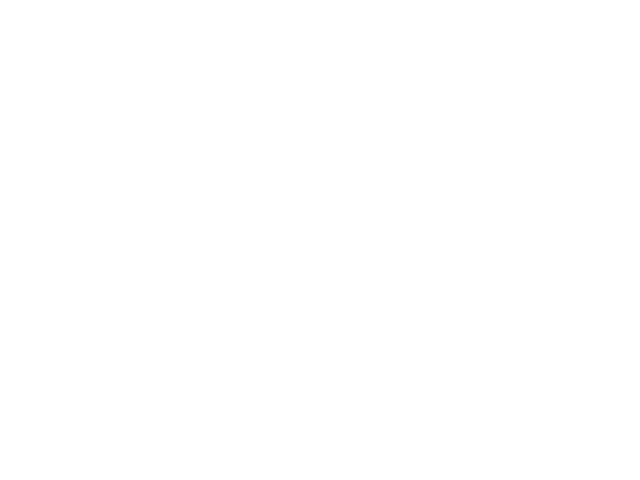

# 🎧 Audio ML Model for Smart Home IoT

## 📌 Project Overview

This project builds a machine learning model to classify environmental sounds and integrate them into a smart home security system.

The system detects:

* 🐶 Dog Bark (normal environment)
* 🚨 Siren (emergency alert)
* 💥 Glass Breaking (intrusion detection)

---

## 🎯 Objectives

* Convert audio signals into meaningful features using MFCC
* Train and compare multiple ML models
* Select the best-performing model
* Enable integration with IoT-based smart home systems

---

## 🧠 Technologies Used

* Python
* NumPy, Pandas
* Librosa (Audio Processing)
* Scikit-learn (ML Models)
* Matplotlib, Seaborn (Visualization)

---

## 📂 Dataset

* ESC-50 Environmental Sound Dataset
* Filtered classes:

  * dog
  * siren
  * glass_breaking

---

## ⚙️ Workflow

```text
Audio → Waveform → MFCC → Feature Vector → ML Model → Prediction
```

---

## 🤖 Models Implemented

| Model         | Description                                     |
| ------------- | ----------------------------------------------- |
| Random Forest | Ensemble learning using multiple decision trees |
| SVM           | Finds optimal boundary between classes          |
| KNN           | Instance-based learning using nearest neighbors |

---

## 📊 Results

| Model         | Accuracy |
| ------------- | -------- |
| Random Forest | 87.5%    |
| SVM           | 75%      |
| KNN           | 66.6%    |
## 📊 Confusion Matrix



### ✅ Final Model Selected:

**Random Forest Classifier**

---

## 🔍 Sample Prediction

The trained model can take an audio file as input and predict its category (dog, siren, or glass breaking).

---

## 🚀 Applications

* Smart Home Security System
* Intrusion Detection
* Emergency Alert Systems

---

## 🔮 Future Enhancements

* Real-time audio detection using microphone
* Deployment on Raspberry Pi / ESP32
* Integration with PIR and RFID sensors
* Deep learning models (CNN) for improved accuracy

---

## 👩‍💻 Author

Minakshi Kaushik

---
